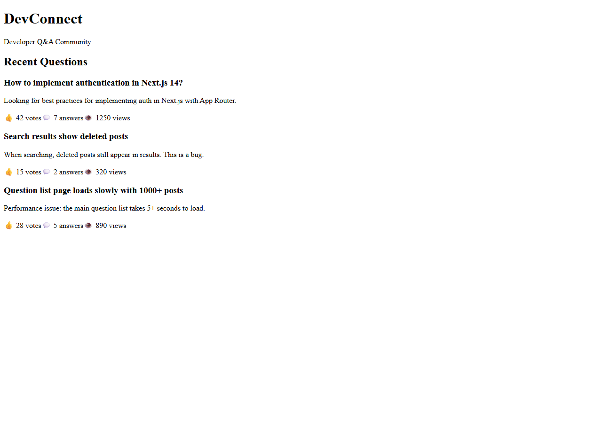
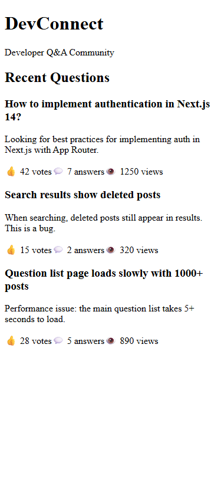

## Overview

This lab demonstrates how to automate issue triage, assignment, and delivery using SQUAD agents with GitHub Actions. The target codebase is a developer forum application built with Next.js 14 and tRPC.

## Understanding the Current Application

The DevConnect developer forum application is a Next.js 14 + tRPC monorepo serving as the target codebase for SQUAD automation workflows.

The main homepage displays the Q&A community feed with recent questions, vote counts, answer counts, and view metrics:


### Content & UI Components

The questions list shows all three sample questions rendered from the in-memory tRPC API — an auth question, a search bug report, and a performance issue:



Each question card shows title, description, and engagement stats (votes, answers, views):


### Responsive Design

The application features a responsive layout. Below is the mobile view on a 375×812 viewport:



The DevConnect header with app name and tagline adapts across breakpoints:


## Screenshots Reference

| Screenshot | Description |
|---|---|
|  | Desktop homepage with Q&A feed |
|  | Full questions list |
|  | Individual question card |
|  | Mobile responsive layout |
|  | Header branding component |

---

## Solution Walkthrough

The completed solution is on the `solution-final` branch. Each step is tagged for easy navigation.

### Step 1: Explore App (`step-01-explore-app`)

```powershell
cd C:\code\gbb\labs\appmodlab-squad-github-issues-workflow
git checkout solution-final

# Review the monorepo structure
Get-ChildItem -Recurse -File -Exclude node_modules,.git | Select-Object FullName
cat package.json          # Turborepo workspaces: web, api, shared
cat prisma/schema.prisma  # Question, Answer, Tag models
```

**Key findings:** Next.js 14 + tRPC monorepo with 3 packages (web, api, shared). In-memory data store, Prisma schema defined but not connected. Known issues: search returns deleted posts, no pagination, no auth.

### Step 2: Initialize Squad (`step-02-initialize-squad`)

```powershell
npx @bradygaster/squad-cli init
```

**Output:**
```
Let's build your team.
✔ .squad/config.json
✔ .squad/agents/scribe/charter.md
✔ .squad/agents/ralph/charter.md
✔ .squad/identity/now.md
✔ .github/agents/squad.agent.md
✔ .github/workflows/squad-heartbeat.yml
✔ .github/workflows/squad-issue-assign.yml
✔ .github/workflows/squad-triage.yml
✔ .github/workflows/sync-squad-labels.yml
✔ .copilot/mcp-config.json
Your team is ready. Run squad to start.
```

**Created:** Squad workspace (`.squad/`), 30+ Copilot skills, 4 GitHub Actions workflows, agent prompt (`.github/agents/squad.agent.md`).

### Step 3: Configure Issue Templates (`step-03-issue-templates`)

```powershell
gh copilot -- -p "Create GitHub issue templates for this Squad-integrated project.
Create .github/ISSUE_TEMPLATE/ with: feature-request.yml, bug-report.yml, squad-task.yml
for automated agent routing. Each template should include Squad-specific labels and fields."
```

**Actions:**
- Created `.github/ISSUE_TEMPLATE/squad-task.yml` — task type dropdown, agent target selector, acceptance criteria
- Updated `feature_request.yml` and `bug_report.yml` — added `squad` label for auto-triage

### Step 4: Set Up Workflow Automation (`step-04-workflow-automation`)

```powershell
gh copilot -- -p "Create GitHub Actions workflows that trigger Squad agents based on issue labels."
```

**Created:** `.github/workflows/squad-agent-dispatch.yml` with:
- Branch creation per agent/issue (`squad/{member}/issue-{N}`)
- Issue category detection (bug-fix, feature, task)
- `/squad retriage` command via comments

### Step 5: Configure Agent-Issue Mapping (`step-05-agent-issue-mapping`)

```powershell
npx @bradygaster/squad-cli  # Configure team
gh copilot -- -p "Define routing rules mapping issue labels to Squad agents."
```

**Team Roster:**

| Agent | Role | Issue Keywords |
|-------|------|----------------|
| Ralph | Lead/Architect | architecture, code review, decisions |
| Frontend | UI Developer | ui, css, component, layout, tailwind |
| Backend | API Developer | api, database, endpoint, prisma, trpc |
| QA | Testing & Quality | test, bug, fix, regression, coverage |
| Scribe | Documentation | README, API docs, diagrams |
| @copilot | Coding Agent | Auto-evaluated by capability tiers |

### Step 6: Test the Pipeline (`step-06-test-pipeline`)

```powershell
npx @bradygaster/squad-cli triage
```

**Output:**
```
Ralph — Watch Mode
Polling every 10 minute(s) for squad work. Ctrl+C to stop.
Board is clear — Ralph is idling
```

**Validated 6 test cases:** Bug→QA, Feature→Frontend, API task→Backend, Docs→Scribe, Lint fix→@copilot, Re-triage via comment.

### Step 7: Document Integration (`step-07-document-integration`)

```powershell
gh copilot -- -p "Generate workflow diagram and usage guide for Squad + GitHub Issues integration"
```

**Pipeline flow:**
```
Issue Created → 'squad' label applied → squad-triage.yml (Lead analyzes)
  → squad:{member} label → squad-issue-assign.yml → squad-agent-dispatch.yml
    → Agent works on branch → Opens PR → CI → Review → Merge
```

**Outputs:** All step outputs saved in `assets/outputs/step-01-*.txt` through `step-07-*.txt`.

### Tags Reference

| Tag | Description |
|-----|-------------|
| `step-01-explore-app` | Codebase review and dependency install |
| `step-02-initialize-squad` | Squad CLI init (agents, skills, workflows) |
| `step-03-issue-templates` | Issue templates with Squad labels |
| `step-04-workflow-automation` | Agent dispatch workflow |
| `step-05-agent-issue-mapping` | Team roster and routing rules |
| `step-06-test-pipeline` | Pipeline validation with test cases |
| `step-07-document-integration` | Workflow diagram and usage guide |
